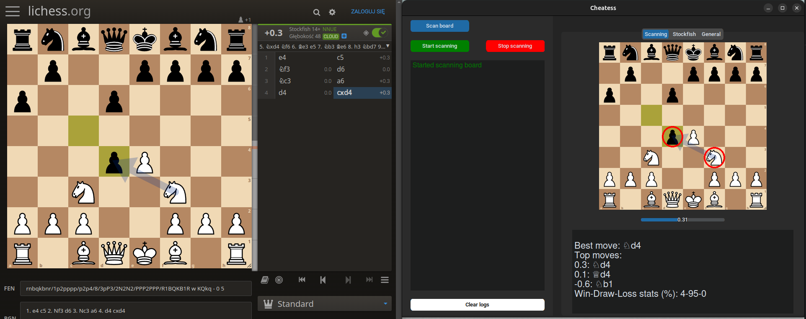
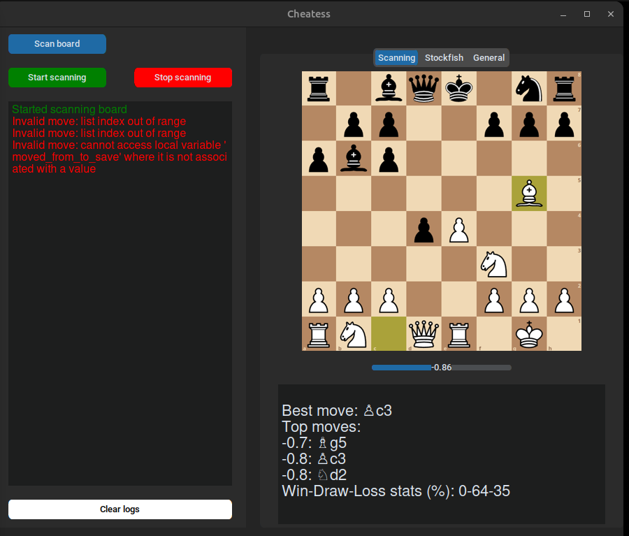
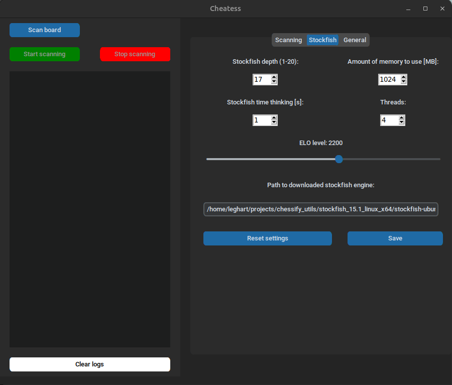

# Cheatess

A windowed application to analyze the current board (from online chess like lichess, chess.com etc.) and present the best stockfish lines to play. Allows you to customize settings and appearance.


# Usage

To run application type:

```
python cheatess/main.py
```

Firstly, you have to set a path to stockfish engine (explained below in section "Installation").

After that you have to take a snapshot of your screen to specify where the board is placed. You can do it by click `scan board` blue button in the top right corner. Then you have to mark (by dragging) the grey box to capture your board. When you release the mouse button, area will be saved in memory.

:warning: :no_entry_sign: During the game, you can not move any window on the marked area - it will disturb app to detect a board - after that you will have to restart application.

Once you have the screen to detect selected, you can click the green `start scanning`" button to start the analysis. When you want to finish scan you can
click `stop scanning`. After that if you would like to scan another board you have to scan board once again.

:heavy_exclamation_mark: If any exception occurs (image below), it will cause
the application to malfunction - it will stop giving new analysis (you will
have to deal with that - don't worry, fix for that is comming :wink:).




# How it works?

When you mark the aread, thread to get screenshots (`scan` thread) of this area will be started. It takes a screenshot every 0.2s and put it to the queue. If the next image is very similar (MSE < 2) it treats this image as the previous one and doesn't queue it.

Clicking the start scanning button will start the `calculate` thread. It takes an image from the queue and tries to define a FEN position using neural networks with trained models. It could take circa 0.5s, so
this is a main reason why the queue was needed. As it is impossible to define a correct FEN with only one picture, Cheatess needs track a game from beginning to end (this is why the app crashes if any exception occurs). What's more, as this is not a valid FEN, it can't be used in `stockfish` module. So the thread defines a move when it collects at least two images (calculates what piece has been moved, from where and to where). When the move is known (e.g. e6), stockfish gets this value and returns the best move, position evalutaion etc.

Every dynamic message which is visible in app, uses a queue system to communicate with GUI.

# Stockfish

## Installation

You have to download stockfish engine from here: https://stockfishchess.org/download/, and type path to place where you store it (Downloaded directory by default) in Cheatess settings.

## Settings

You are able to change the most important settings like:

- depth
- hash (memory to use)
- time to think
- amount of threads

Additionally you can change a elo rating from 1500 to 2700 by sliding bar.
The only one required thing to set is path to stockfish engine (described above). Every setting is stored in cache so it's not necessary to set these
options everytime. Below is presented a screen with stockfish settings panel.


# Dataset

Data for training and testig model got from here: https://www.kaggle.com/datasets/koryakinp/chess-positions

## Changing trained models - :warning: only for advanced users :warning:

If you want to train model to detect FEN's from board images by yourself, you have to download any dataset (it is probably one of the best availables for free). To train model, you can change train-variables like epoches, neural network structure and much more. The only change required is to set a path to directory with train-test dataset (`DATA_PATH`). To start training call method `start_train()` from `src/cnn/train.py`. Your created models are saved in directory `models/custom`. To go back to default models, remove every file from `models/custom`.

# Used technologies
- python 3.11
- tensorflow + keras
- customtkinter
