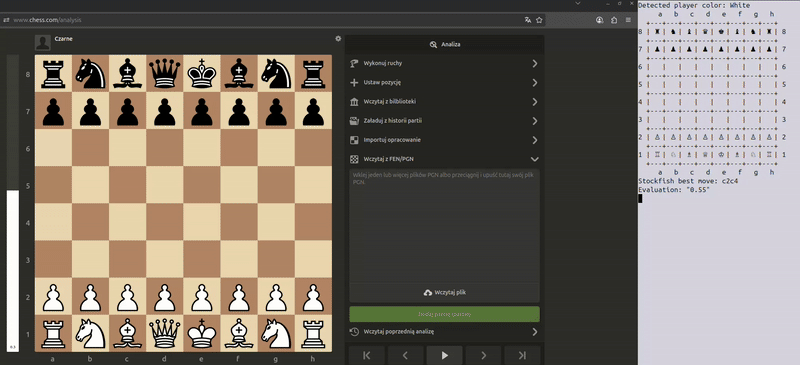
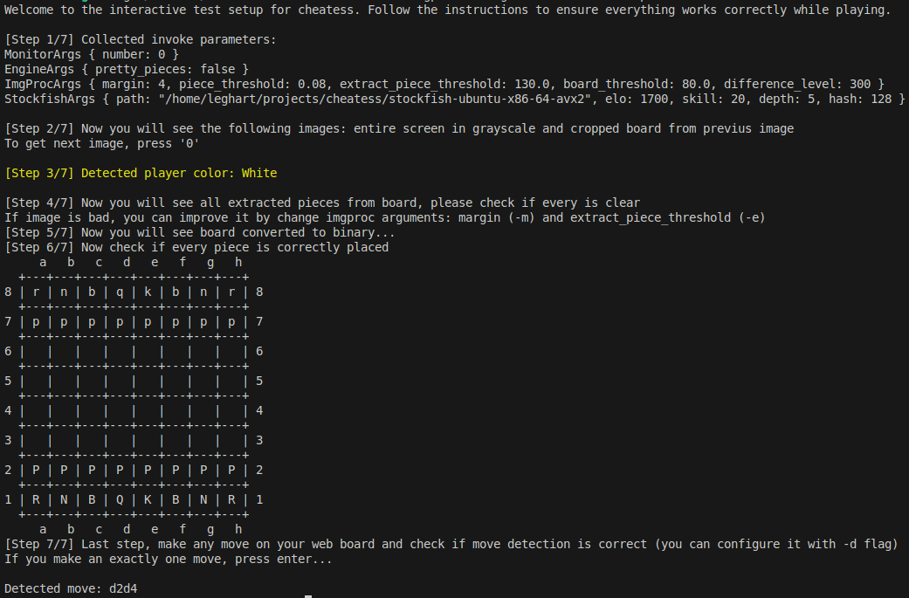
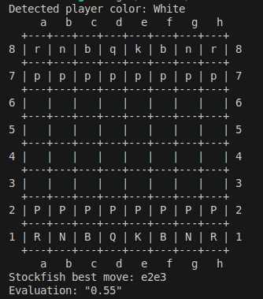
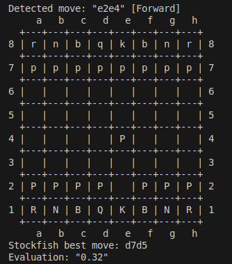
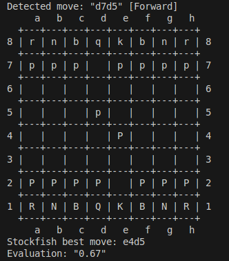
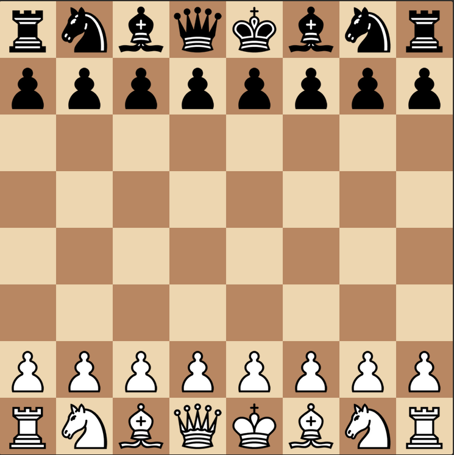

# Cheatess


Cheatess is an application that analyzes a live chessboard (e.g., from online platforms like [Lichess](https://lichess.org) or [Chess.com](https://www.chess.com)) and displays the best moves suggested by the Stockfish engine.

It works by monitoring your screen in real time, detecting board positions, and evaluating them using a configurable Stockfish backend. It allows you to run the application directly from the terminal, play as either white or black, and analyze a live chessboard in real time by monitoring your screen and displaying the best moves based on a preconfigured Stockfish engine.

<div align="center">
  
</div>

---

## Table of Contents

- [Requirements](#requirements)
- [Usage](#usage)
  - [Test Mode](#test-mode)
  - [Game Mode](#game-mode)
- [Docker image](#docker)
- [Recommendations](#recommendations)

---

# Requirements

- A downloaded version of Stockfish compatible with your operating system (https://stockfishchess.org/download/).
- Necessary packages for OpenCV support. For example, on Ubuntu:
  ```bash
  sudo apt install libopencv-dev libwayland-dev pkg-config libpipewire-0.3-dev libegl-dev clang llvm-dev
  ```
- Use `X11` instead of default `waylander`

# Usage

## Arguments

Cheatess Core allows you to customize various runtime parameters using command-line arguments.  
There are several subparsers that group related options: `stockfish`, `monitor`, `engine`, and `imgproc`.

### Stockfish

Configure the behavior of the Stockfish engine:

- `--path`, `-p` — Path to the Stockfish executable  
  _(See the [Requirements](#requirements) section for more info)_

- `--elo`, `-e` — Set the ELO rating for the engine (default: `1700`)

- `--skill`, `-s` — Skill level of Stockfish (range: 0–20, default: `20`)

- `--depth`, `-d` — How deep the engine should analyze each move  
  ⚠️ Higher values increase response time (default: `5`)

- `--hash` — Memory usage for Stockfish hash tables in MB (default: `16`)

---

### Monitor

Configure which monitor to use for board detection:

- `--number`, `-n` — Select monitor by index (default: `0`, primary monitor)

---

### Engine

Customize how the engine output is displayed in the terminal:

- `--pretty`, `-p` — Use Unicode chess pieces instead of plain letters (default: `false`)

---

### Image Processing (`imgproc`)

Fine-tune the parameters related to board and piece recognition:

- `--margin`, `-m` — Margin (in pixels) around each square when extracting pieces (default: `5`)

- `--piece-threshold`, `-p` — Threshold for template matching when detecting pieces (default: `0.1`)

- `--extract-piece-threshold`, `-e` — Threshold used when extracting a piece image from a binary board (default: `127.0`)

- `--board-threshold`, `-b` — Threshold for converting the grayscale board to binary (used in piece detection)

- `--difference-level`, `-d` — Pixel difference level between two board images to detect a move (default: `500`)

## Test mode

Before starting a real game, you should configure the parameters to match the appearance of your chess website (e.g., chess.com or lichess.org).
To launch the configuration interface, run:

```bash
cheatess-core --mode test <params to configuration>
```

This will start an interactive test mode where you can verify whether everything is detected correctly.
If you encounter any issues, adjust the parameters manually until the setup works reliably.
Failing to do so may cause errors during an actual game.

<div align="center">  </div>

## Game mode

To start the game, simply run:

```bash
cheatess-core
```

The program will begin monitoring your screen for chess activity. When it detects a move, it will display the move in the terminal, like in the examples below:

<p align="center"> 
     
     
     
</p>

# Docker image

You can use the prebuilt image with the core logic by running:

```
docker pull leghart/cheatess_prod:latest
```

Alternatively, you can build it manually with:

```
docker build -f docker/Dockerfile.prod -t cheatess_prod .
```

To use the image, you can run `scripts/start_core.sh` or manually execute

```
docker run -it -e DISPLAY=$DISPLAY -v /tmp/.X11-unix:/tmp/.X11-unix cheatess_prod <flags>
```

The argument with path to stockfish binary is automatically applied inside image.

# Recommendations

For the best performance, use a board and piece design that is clear and easy to recognize.
We recommend using a layout similar to the one shown below:

<div align="center">  </div>

If your monitor resolution is 1920x1080, the following presets should work well:

- chesscom: (default values): `-m 5 -b 100 -e 127 -p 0.1 -d 500`

- lichess: `imgproc -m 4 -b 80 -e 130 -p 0.08 -d 300`

You can always fine-tune these parameters based on your specific board appearance and
screen settings.
